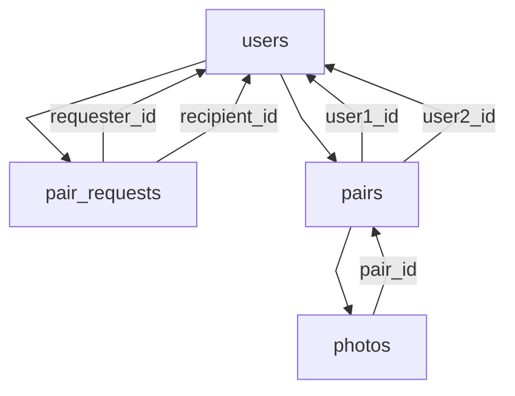

# Plán implementace funkce párování uživatelů "Naše fotky"

Tento dokument popisuje plán pro přidání funkce, která umožní dvěma uživatelům vytvořit "pár" a sdílet společné fotky.

## 1. Změny v databázi

Budou vytvořeny nové tabulky pro správu párování a upravena stávající tabulka `photos`.

*   **Tabulka `pair_requests`:**
    *   `id` (INT, PRIMARY KEY, AUTO_INCREMENT)
    *   `requester_id` (INT, FOREIGN KEY odkazující na `users.id`)
    *   `recipient_id` (INT, FOREIGN KEY odkazující na `users.id`)
    *   `status` (ENUM('pending', 'accepted', 'rejected'), DEFAULT 'pending')
    *   `created_at` (DATETIME)
    *   `updated_at` (DATETIME)

*   **Tabulka `pairs`:**
    *   `id` (INT, PRIMARY KEY, AUTO_INCREMENT)
    *   `user1_id` (INT, FOREIGN KEY odkazující na `users.id`)
    *   `user2_id` (INT, FOREIGN KEY odkazující na `users.id`)
    *   `established_at` (DATETIME)

*   **Úprava tabulky `photos`:**
    *   Přidat sloupec `pair_id` (INT, NULLABLE, FOREIGN KEY odkazující na `pairs.id`). Fotka může patřit buď konkrétnímu uživateli (`user_id` je vyplněno a `pair_id` je NULL) nebo páru (`pair_id` je vyplněno a `user_id` je NULL nebo odkazuje na jednoho z členů páru). Bude nutné upřesnit logiku pro správu fotek páru.

## 2. Backendová implementace

Budou vytvořeny nové endpointy a upraveny stávající pro správu párování a načítání fotek.

*   `send_pair_request.php`: Zpracuje požadavek na odeslání žádosti o párování (vytvoří záznam v `pair_requests`).
*   `handle_pair_request.php`: Zpracuje přijetí/odmítnutí žádosti (aktualizuje `pair_requests`, při přijetí vytvoří záznam v `pairs`).
*   `get_pairing_status.php`: Vrátí stav párování pro aktuálně přihlášeného uživatele.
*   Úprava `get_random_photo.php` a logiky načítání fotek v `memories.php`: Zahrne fotky patřící buď přihlášenému uživateli NEBO jeho páru (pokud existuje).

## 3. Frontendové úpravy

Budou provedeny změny na frontendových stránkách pro interakci uživatelů s funkcí párování.

*   Přidat možnost najít/vybrat jiného uživatele pro odeslání žádosti o párování.
*   Přidat tlačítko/akci pro odeslání žádosti o párování.
*   Přidat položku "Žádosti o párování" do hamburger menu.
*   Vytvořit stránku `pair_requests.php` pro zobrazení přijatých a odeslaných žádostí s možností přijmout/odmítnout.
*   Upravit JavaScript na `index.php` a PHP logiku na `memories.php` pro načítání fotek na základě stavu párování uživatele.

## Další kroky

Po schválení tohoto plánu se můžeme přesunout do režimu Kód a začít s implementací jednotlivých částí, počínaje změnami v databázi.